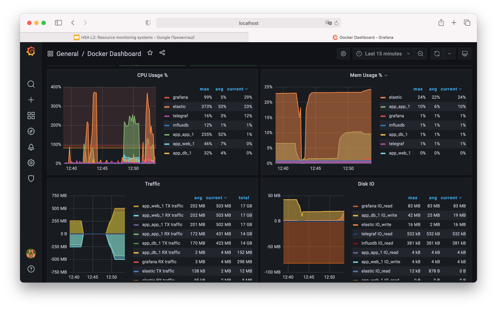

# HW2. Resource Monitoring Systems

## How to run

1. run app `cd app && make setup && make run`
2. run TIG stack `cd docker-influxdb-grafana && ./run.sh`
3. run ab benchmark `./benchmark.sh`

## Results

